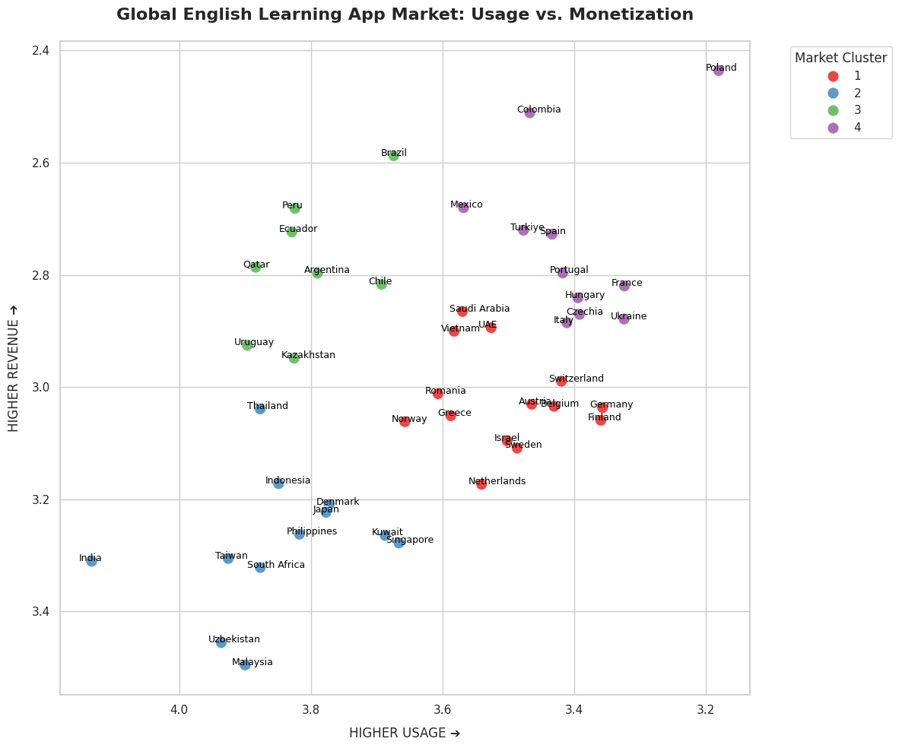

# Global Market Clustering: EdTech Go-To-Market Strategy

## Overview
This repository contains the data pipeline, K-Means clustering model, and strategic analysis used to determine the optimal global launch sequence for a high-friction, AI-powered User-Generated Content (UGC) memory card app. 

## The Business Problem
Standard SaaS expansions rely heavily on macroeconomic indicators like GDP per capita and the English Proficiency Index (EPI). I tested these baseline assumptions and proved them flawed for our specific product architecture. High-wealth, high-EPI countries treat language apps as casual games, resulting in low paid conversion rates for high-friction utilities. 
To find the true target markets, this project segments 45 global digital economies based purely on behavioral data: **Usage Volume** (Free Ranks) vs. **Willingness to Pay** (Grossing Ranks).

## Methodology
1. **Data Sourcing:** Processed global app store rankings for top language and flashcard apps (e.g., Duolingo, Babbel, EWA, Memrise, Praktika).
2. **Transformations:** Applied a Log10 transformation to category ranks to linearize the extreme power-law distribution of app store economies.
3. **Clustering:** Deployed K-Means clustering (k=4) on median `Log_Free_Rank` and `Log_Gross_Rank` to map the global digital landscape.
4. **Macroeconomic Validation:** Compared GDP per capita and the English Proficiency Index (EPI) across the four generated clusters, mathematically verifying whether traditional economic indicators exhibited statistically significant differences between the behaviorally defined quadrants.

## Global Market Landscape

## Key Insights: The 4 Global Market Clusters

* **Cluster 4: The Golden Quadrant (e.g., Poland, Mexico, Spain)** * *Profile:* Massive organic download volume combined with elite monetization. 
  * *Strategy:* The primary scale engine. High potential, but requires bridging UX friction to capture the mass market.

* **Cluster 3: The High-Intent Niche (e.g., Argentina, Brazil, Kazakhstan)**
  * *Profile:* Low organic search volume, but elite monetization. 
  * *Strategy:* The perfect testing sandbox. Users here are desperate professionals upskilling for their careers. Cheap User Acquisition (UA) yields pure, highly-motivated cohorts.

* **Cluster 1: The Saturated Trap (e.g., Germany, UAE, Sweden)**
  * *Profile:* High wealth (GDP) and High EPI, leading to high download volume but terrible monetization.
  * *Strategy:* De-prioritize UA budget. High English proficiency means language apps are treated as casual hobbies; users refuse to hit a premium paywall.

* **Cluster 2: The Dead Zone (e.g., Japan, India)**
  * *Profile:* Low volume, low revenue. 
  * *Strategy:* Ignore for initial rollout.

## Strategic Launch Rollout

Based on the data, the product will follow a three-phase rollout sequence to mitigate risk and maximize Monthly Recurring Revenue (MRR):

1. **Phase 1: Product-Market Fit (Beta)**
   * **LATAM Sandbox (High Intent):** Launch targeted UA campaigns in Brazil/Argentina to stress-test the AI core mechanics on a highly motivated, cheap-to-acquire professional audience.
   * **Poland Test (High Volume):** Run a simultaneous beta in our ultimate scale market using **pre-built AI study decks** (e.g., IT/Business English) to bypass UGC friction and capture casual volume.
2. **Phase 2: Expanding Target**
   * Optimize the paywall and AI-generation flows using Phase 1 data. Apply the "Poland Playbook" (pre-seeded content + premium UGC upsell) to Mexico and Spain.
3. **Phase 3: Scaling and Optimizing**
   * Shift the majority of the marketing budget to aggressive UA in proven Tier-1 markets (Cluster 4) to maximize MRR and introduce B2B features.

