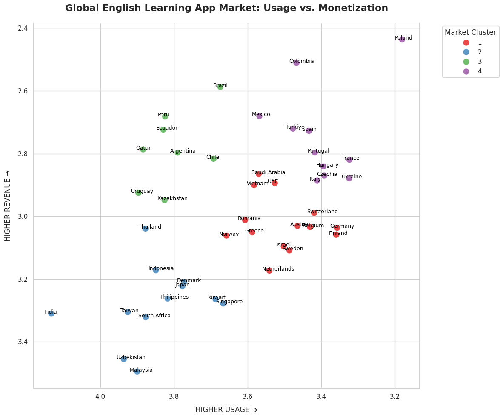

# Global Market Clustering: EdTech Go-To-Market Strategy

## Business Context
An AI-powered language learning app faced a critical expansion challenge: identifying the most promising international markets for launch.

Traditional expansion strategies rely on macroeconomic indicators such as GDP per capita and English Proficiency Index (EPI). However, these metrics do not necessarily reflect user willingness to pay for high-friction educational products.

---

## Objective
Identify high-potential markets for product launch by segmenting countries based on actual user behavior:
- Demand (usage volume)
- Monetization potential (willingness to pay)

---

## Data
- App store rankings (free & grossing) for leading language and flashcard apps:
  - Duolingo, Babbel, Memrise, EWA, Praktika
- Coverage: 45 countries (digital economies)

---

## Methodology

### Data Transformation
- Applied log10 transformation to normalize highly skewed ranking distributions

### Feature Engineering
- Median **Free Rank** → proxy for demand  
- Median **Grossing Rank** → proxy for monetization  

### Clustering
- K-Means clustering (k=4)
- Segmented countries into behavioral market groups

### Validation
- Compared GDP per capita and EPI across clusters
- Found no consistent alignment between macroeconomic indicators and monetization behavior

---

## Key Insight

Macroeconomic indicators (GDP, EPI) are poor predictors of monetization for this product category.

Instead, **user behavior (demand vs. willingness to pay)** provides a more reliable segmentation of global markets.

---

## Global Market Landscape

## Market Segments

### Cluster 4 — High Volume & High Monetization (“Core Growth Markets”)
Examples: Poland, Mexico, Spain  

- Strong organic demand  
- High revenue potential  

**Implication:** Primary markets for scaling  
**Challenge:** Need to reduce onboarding friction to capture mass audience  

---

### Cluster 3 — Low Volume & High Monetization (“High-Intent Niche”)
Examples: Brazil, Argentina, Kazakhstan  

- Smaller user base  
- Highly motivated, high-paying users  

**Implication:** Ideal for testing and iteration  
- Lower acquisition cost  
- High signal quality  

---

### Cluster 1 — High Volume & Low Monetization (“Saturated Markets”)
Examples: Germany, UAE, Sweden  

- High usage but weak monetization  

**Insight:**  
High English proficiency → product perceived as casual, not essential  

**Implication:**  
- Low ROI on paid acquisition  
- De-prioritize for early expansion  

---

### Cluster 2 — Low Volume & Low Monetization (“Low Priority”)
Examples: Japan, India  

- Weak demand and revenue  

**Implication:**  
- Exclude from initial rollout  

---

## Business Impact

This segmentation directly informed the company’s global expansion strategy by:

- Identifying high-ROI markets  
- Avoiding inefficient marketing spend in low-conversion regions  
- Structuring a phased rollout strategy  

---

## Go-To-Market Strategy

### Phase 1 — Product-Market Fit
- Launch in Brazil & Argentina (high-intent users)
- Run targeted acquisition to validate core product mechanics  

Parallel test:
- Poland (high-volume market)
- Use pre-built content to reduce onboarding friction  

---

### Phase 2 — Expansion
- Optimize paywall and onboarding  
- Expand to Mexico and Spain using validated strategy  

---

### Phase 3 — Scaling
- Concentrate marketing budget on top-performing markets (Cluster 4)  
- Introduce B2B features to increase revenue  

---

## Key Takeaways

- Behavioral segmentation outperforms macroeconomic indicators  
- Monetization depends more on user intent than country wealth  
- Strategic sequencing of markets reduces risk and increases ROI  

---

## Tech Stack
- Python  
- Pandas, NumPy  
- Scikit-learn (K-Means)  
- Data visualization libraries  

